# Задание на семестр для магистров ИКТБ ТОИББД
---
Для сбора событий был установлен пакет Falco Cloud Native Runtime Security с использованием Kernel драйвера.
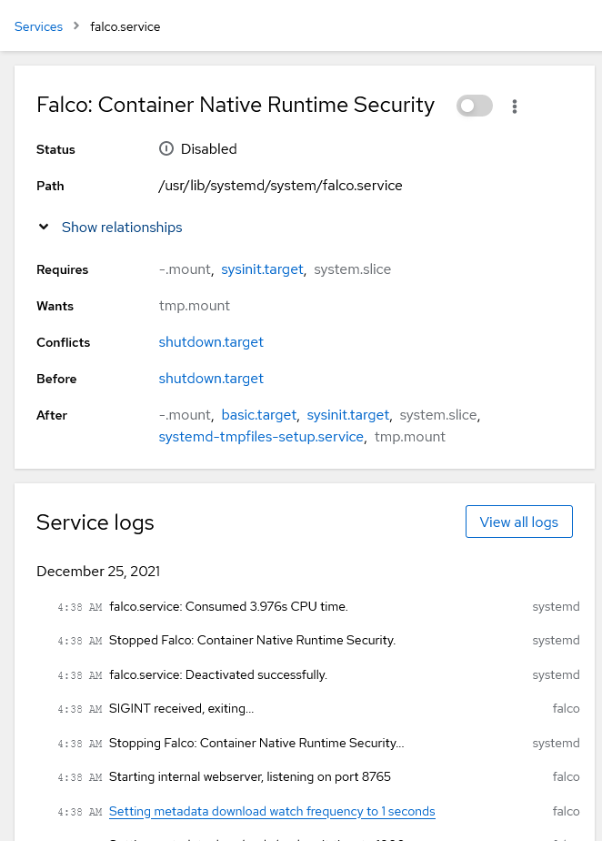
Как видно из журнала событий сервиса systemd, Falco корректно обрабатывает события безопасности.
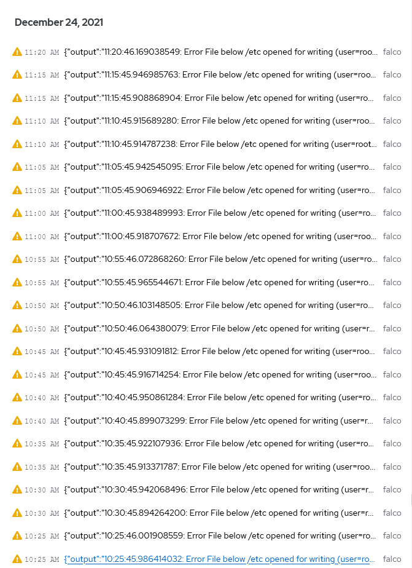
В качестве экспортера событий безопасности из Falco был выбран экспортер [Falco Sidekick](https://github.com/falcosecurity/falcosidekick), позволяющей экспортировать данные в множество систем, включая систему мониторинга Prometheus и аналитическую платформу Grafana.
Prometheus и Grafana были установленны в среде контейниризации Docker и был написан следующий docker-compose файл:
```yaml
version: "3.7"

services:
  node_exporter:
    image: quay.io/prometheus/node-exporter:latest
    container_name: node_exporter
    command:
      - '--path.rootfs=/host'
    pid: host
    restart: unless-stopped
    volumes:
      - '/:/host:ro,rslave'
    networks:
      app-network:
        ipv4_address: 10.10.0.2

  prometheus:
    image: prom/prometheus:latest
    container_name: prometheus
    restart: unless-stopped
    ports:
      - "8080:9090"
    volumes:
      - "/etc/prometheus:/etc/prometheus"
    networks:
      app-network:
        ipv4_address: 10.10.0.3

  grafana-oss:
    image: grafana/grafana-oss:latest
    container_name: grafana-oss
    restart: unless-stopped
    ports:
      - "3000:3000"
    volumes:
      - "grafana-storage:/var/lib/grafana"
    networks:
      app-network:
        ipv4_address: 10.10.0.4

  falcosidekick:
    image: falcosecurity/falcosidekick
    container_name: falcosidekick
    restart: unless-stopped
    ports:
      - "2801:2801"
    networks:
      app-network:
        ipv4_address: 10.10.0.5

volumes:
  grafana-storage:
    driver: local

networks:
  app-network:
    ipam:
      driver: default
      config:
        - subnet: "10.10.0.0/24"
```
Prometheus автоматически собиарает данные с указаных в prometheus.yml таргетов по эндпоинту /metrics. В данном случае в качестве таргетов были указаны экспортеры Falco Sidekick, Node Exporter и Prometheus.
В Grafana уже есть встроенная поддержка базы данных Prometheus как источника данных, из-за чего интеграция данных двух система является довольно тривиальной. 
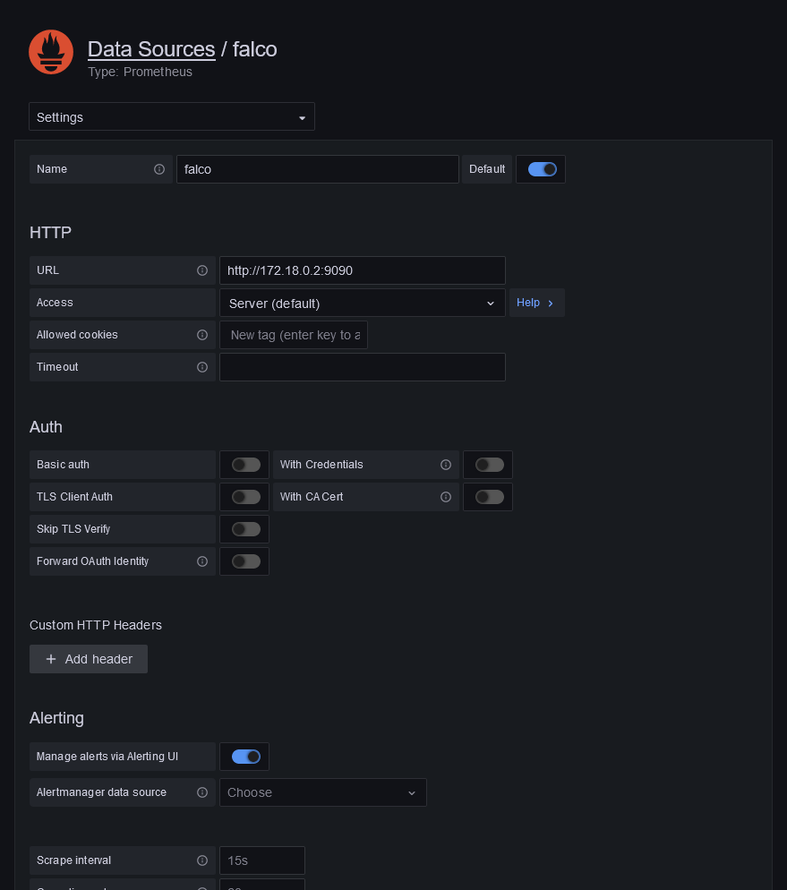
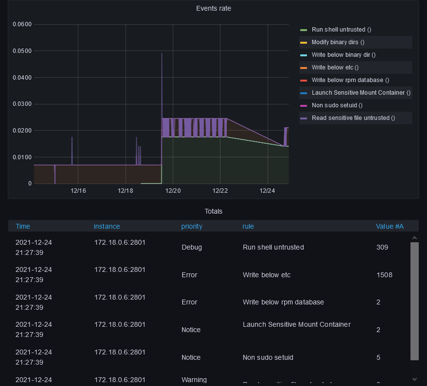
Для экспорта информации о производительности узла был выбран node-exporter, данный экспортер является официальным и наиболее популярным.
Для данной работе для машиного обучения был использованн пакет программного обеспечения Splunk Enterprise.
Splunk использует машинные данные для выявления закономерностей данных, предоставления метрик, диагностики проблем и предоставления аналитических данных для бизнес-операций. Splunk - это горизонтальная технология, используемая для управления приложениями, обеспечения безопасности и соответствия нормативным требованиям, а также для бизнес-аналитики и веб-аналитики.
Для машинного обучения был использован предварительно размеченный набор данных, содержащий информацию о том, является ли запись в строке аномальной.
В данной работе рассматриваются следующие модели машинного обучения, включенные в Splunk:
1.  Logistic regression
   Логистическая регрессия - это статистическая модель, которая в своей основной форме использует логистическую функцию для моделирования бинарной зависимой переменной, хотя существует множество более сложных расширений. В регрессионном анализе логистическая регрессия (или логит-регрессия) - это оценка параметров логистической модели (разновидность бинарной регрессии). Математически, бинарная логистическая модель имеет зависимую переменную с двумя возможными значениями, например, зачет/незачет, которая представлена индикаторной переменной, где два значения обозначены "0" и "1". В логистической модели log-odds (логарифм шансов) для значения, обозначенного "1", является линейной комбинацией одной или более независимых переменных ("предикторов"); независимые переменные могут быть бинарными (два класса, кодируемые индикаторной переменной) или непрерывными (любое реальное значение). Соответствующая вероятность значения, обозначенного "1", может варьироваться между 0 (безусловно, значение "0") и 1 (безусловно, значение "1"), отсюда и обозначение; функция, преобразующая логарифмические коэффициенты в вероятности, является логистической функцией, отсюда и название. Единица измерения для шкалы log-odds называется logit, от logistic unit, отсюда и альтернативные названия. 
   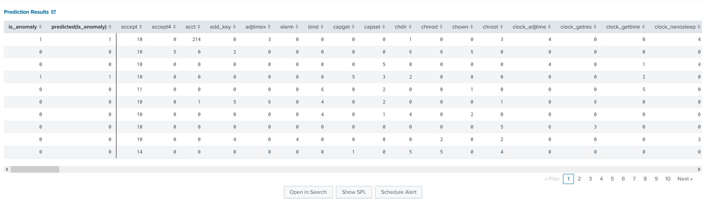
   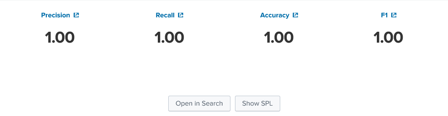
   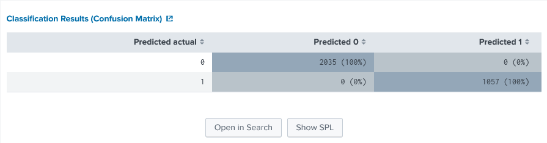
   
2. Random Forest Classifier
   Случайные леса или случайные леса решений - это метод ансамблевого обучения для классификации, регрессии и других задач, который работает путем построения множества деревьев решений во время обучения. Для задач классификации выходным результатом случайного леса является класс, выбранный большинством деревьев. Для задач регрессии возвращается средний или усредненный прогноз отдельных деревьев. Случайные леса решений исправляют привычку деревьев решений чрезмерно подстраиваться под обучающий набор.  Случайные леса в целом превосходят деревья решений, но их точность ниже, чем у деревьев с градиентным усилением. Однако характеристики данных могут влиять на их производительность.
   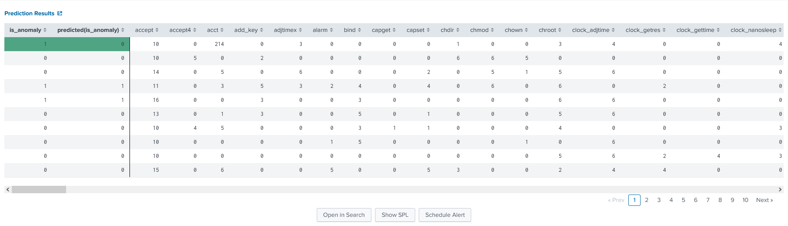
   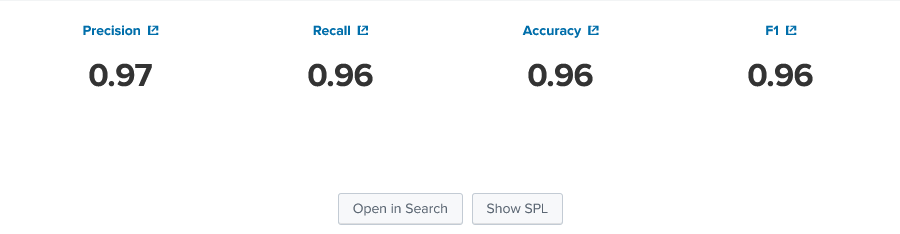
   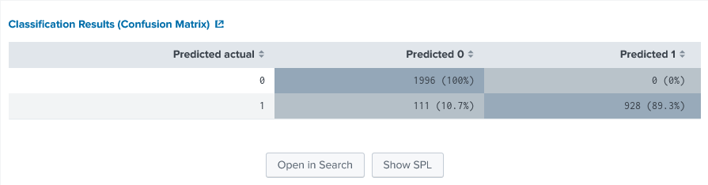
   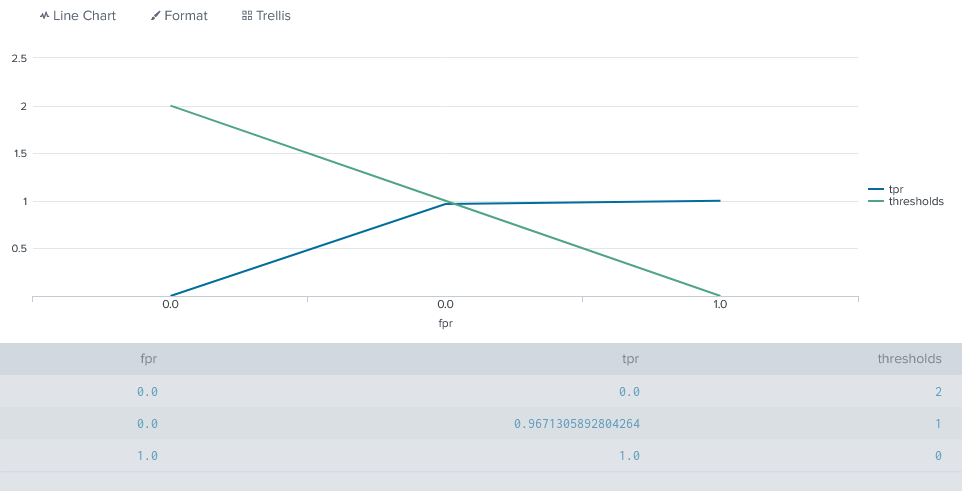
3. Обучение на дереве решений или индукция деревьев решений - это один из подходов к прогностическому моделированию, используемый в статистике, анализе данных и машинном обучении. Он использует дерево решений (как прогностическую модель) для перехода от наблюдений за элементом (представленных в ветвях) к выводам о целевом значении элемента (представленных в листьях). Древовидные модели, в которых целевая переменная может принимать дискретный набор значений, называются деревьями классификации.
   
   
   
   
---
Информация о системе 
- OS: Fedora 34 (Server Edition) x86_64
- Host: ProLiant MicroServer
- Kernel: 5.15.10-100.fc34.x86_64
- Shell: bash 5.1.0
- Terminal: /dev/pts/0
- CPU: AMD Turion II Neo N54L (2) @ 2.200GHz
- GPU: AMD ATI Mobility Radeon HD 4225/4250
- Memory: 3661MiB